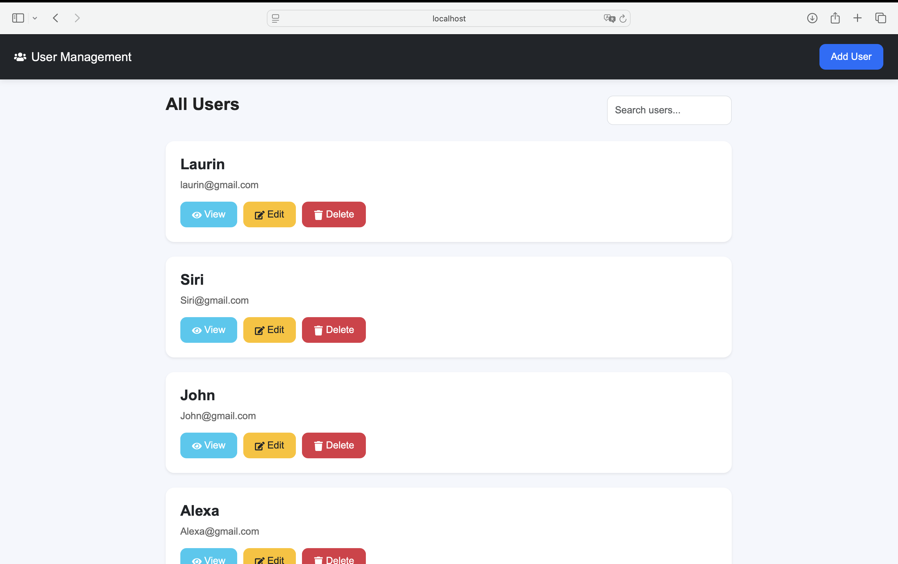
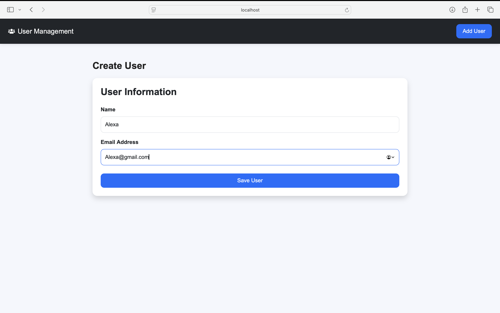
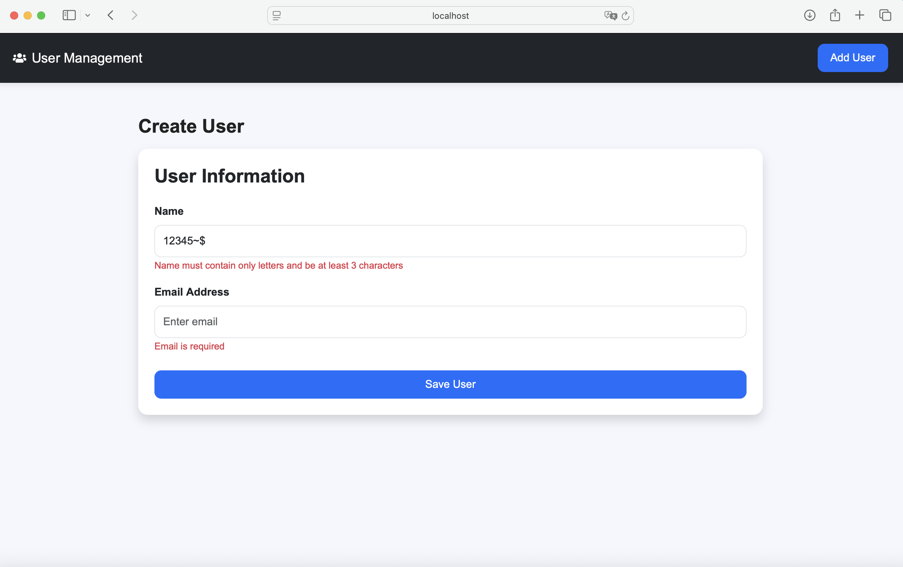
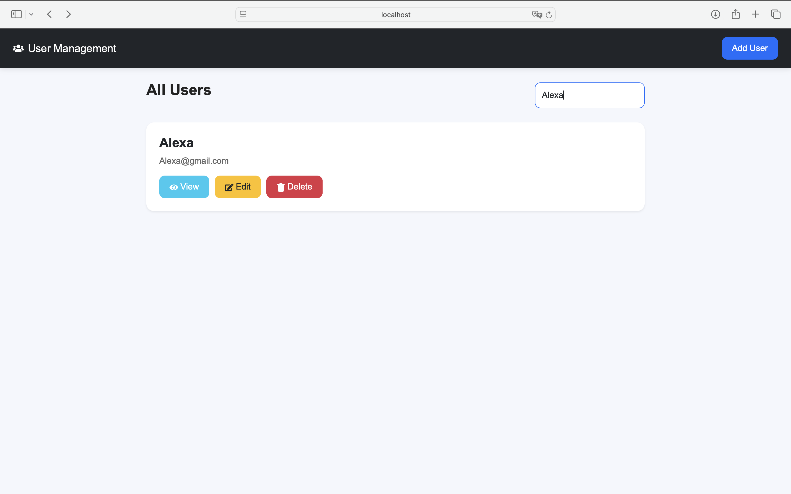
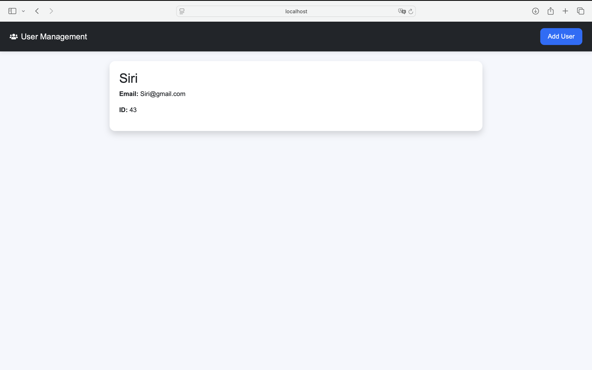
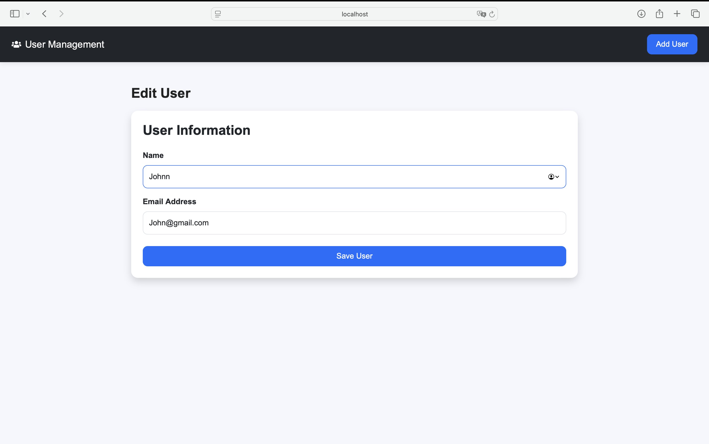

## Responsive User Management CRUD Application

A modern and responsive frontend CRUD application built with React.js that integrates with REST APIs to manage users efficiently.

This application allows users to:
- View all users
- Create new users
- Edit existing users
- Delete users
- Search users
- View user details

The project focuses on clean UI/UX, reusable component architecture, responsive design, API integration, and maintainable frontend development practices.

---
## Features

- View all users
- Create user
- Edit user
- Delete user
- View user details
- Search users
- Responsive UI
- Form validation
- Loading states
- Error handling
- Reusable components

## Application Preview

### Home Page



---

### Create User



---

### Form Validation



---

### Search Users



---

### User Details



---

### Edit User



---


## Tech Stack

- React.js
- Axios
- React Router DOM
- Bootstrap
- React Icons

---

# Key Features

## Responsive User Interface

- Fully responsive layout
- Mobile-friendly design
- Modern card-based UI
- Smooth user experience

---

## Form Validation

Implemented validation for:
- Required fields
- Email format validation
- Username validation
- Restriction of special characters and numbers in name field

---

## Error Handling

Implemented proper error handling using:
- try/catch blocks
- User-friendly alerts
- Error states for failed API requests

---

## Loading States

Added loading indicators while fetching API data for better user experience.

---

## Reusable Components

Reusable components created for:
- Navbar
- User cards
- User forms
- Loader

This improves:
- scalability
- maintainability
- code reusability

---

## Folder Structure

```txt
src
│
├── api
│   └── userApi.js
│
├── components
│   ├── Loader.js
│   ├── Navbar.js
│   ├── UserCard.js
│   └── UserForm.js
│
├── pages
│   ├── CreateUser.js
│   ├── EditUser.js
│   ├── Home.js
│   └── UserDetails.js
│
├── App.js
├── App.css
└── index.js
```

## Installation

### Clone repository

```bash
git clone https://github.com/AfrahMukadam/React-CRUD-App.git
```

### Install dependencies

```bash
npm install
```

### Start development server

```bash
npm start
```

## API Integration

# API Integration

Integrated with backend APIs using Axios.

### API Endpoints Used

| Method | Endpoint | Description |
|---|---|---|
| GET | `/users/` | Fetch all users |
| POST | `/users` | Create new user |
| GET | `/users/{id}/` | Get user details |
| PATCH | `/users/{id}` | Update user |
| DELETE | `/users/{id}/` | Delete user |

## Evaluation Criteria Covered

- Clean UI/UX
- Responsive design
- Component reusability
- Error handling
- Form validation
- Proper folder structure
- API integration

## Author

Afrah Mukadam